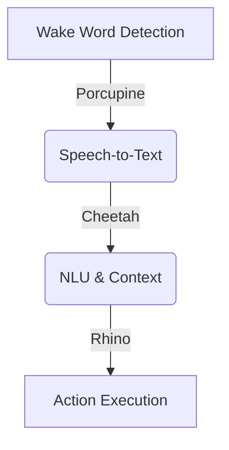

# Pico Voice

以下是针对快速掌握 **Picovoice 架构** 的核心知识要点和实操路径，通过分层解析帮助您快速理解其工作原理：

### 一、Picovoice 核心架构组成
Picovoice 的核心是 **端到端的语音交互流水线**，分为三个关键层级：



1. **Porcupine（唤醒词检测）**
   - **功能**：实时监听并识别预设的关键词（如 "Hey Robot"）
   - **特点**：基于轻量级神经网络，支持 **WebAssembly** 在浏览器端运行
   - **延迟**：<200ms，资源占用 <2MB

2. **Cheetah（语音转文本）**
   - **功能**：将用户语音实时转换为文本
   - **模式**：支持流式处理（逐帧识别），适合实时对话
   - **精度**：英文识别准确率 >95%（中文需自定义模型）

3. **Rhino（语义理解）**
   - **功能**：解析文本意图并提取上下文参数
   - **示例**：用户说 "打开客厅的灯" → 输出 `{intent: "control_light", location: "客厅"}`

---

### 二、浏览器端集成关键技术

#### 1. WebAssembly 模块加载
Picovoice 的核心能力通过 **WebAssembly** 在浏览器中运行：
```javascript
// 初始化 Porcupine
const porcupine = await PorcupineWeb.PorcupineWorkerFactory.create(
  accessKey: "YOUR_ACCESS_KEY",
  keyword: { builtin: "Alexa" }, // 内置唤醒词
  model: { publicPath: "path/to/porcupine_params.pv" }
);
```

#### 2. 音频流处理
使用 **Web Audio API** 捕获和处理麦克风输入：
```javascript
navigator.mediaDevices.getUserMedia({ audio: true })
  .then(stream => {
    const audioContext = new AudioContext();
    const microphone = audioContext.createMediaStreamSource(stream);
    
    // 创建音频处理器
    const processor = audioContext.createScriptProcessor(512, 1, 1);
    microphone.connect(processor);
    
    // 实时处理音频帧
    processor.onaudioprocess = (event) => {
      const pcmFrame = new Int16Array(event.inputBuffer.getChannelData(0));
      porcupine.process(pcmFrame); // 送入唤醒词检测
    };
  });
```

#### 3. 事件驱动交互
```javascript
// 唤醒词检测回调
porcupine.on('detected', () => {
  startConversation(); // 启动对话流程
  showVisualFeedback(); // 例如 Live2D 模型睁眼
});

// 错误处理
porcupine.on('error', (error) => {
  console.error('Porcupine Error:', error);
});
```

---

### 三、上下文管理实战模式

#### 1. 会话生命周期控制
```javascript
class ConversationManager {
  constructor() {
    this.isActive = false;
    this.contextStack = [];
  }

  start() {
    this.isActive = true;
    this.contextStack = []; // 重置上下文
    cheetah.start(); // 启动语音识别
  }

  processText(text) {
    const intent = rhino.process(text); // 获取意图
    this.handleIntent(intent);
  }

  handleIntent(intent) {
    if (intent === 'goodbye') {
      this.end();
    } else {
      // 调用对应功能模块
    }
  }

  end() {
    this.isActive = false;
    cheetah.stop(); // 停止识别
  }
}
```

#### 2. 与 LLM 的协同工作
```python
# 后端处理示例（FastAPI）
async def handle_message(text: str, session_id: str):
    # 从 Redis 获取历史
    history = redis.get(session_id) or []
    
    # 构建 LLM 请求
    messages = [
        {"role": "system", "content": "当前对话上下文: 天气查询"},
        *history,
        {"role": "user", "content": text}
    ]
    
    response = openai.ChatCompletion.create(
        model="gpt-4",
        messages=messages,
        tools=[weather_tool]  # 功能调用定义
    )
    
    # 处理功能调用
    if response.choices[0].message.tool_calls:
        return handle_tool_call(response)
    
    # 保存最新上下文
    redis.set(session_id, messages + [response.message])
```

---

### 四、关键调试技巧

#### 1. 唤醒词灵敏度调整
```javascript
// 创建 Porcupine 时设置灵敏度（0-1）
const porcupine = await PorcupineWeb.create(
  keywords: [{ builtin: "Hey Robot", sensitivity: 0.7 }]
);
```

#### 2. 实时音频可视化
```html
<!-- 在页面中添加 Canvas 用于波形绘制 -->
<canvas id="waveform"></canvas>

<script>
// 使用 Web Audio API 分析频域数据
const analyser = audioContext.createAnalyser();
microphone.connect(analyser);

function drawWaveform() {
  const dataArray = new Uint8Array(analyser.frequencyBinCount);
  analyser.getByteTimeDomainData(dataArray);
  
  // 绘制到 Canvas
  // ...
  requestAnimationFrame(drawWaveform);
}
</script>
```

#### 3. 性能优化指标
```bash
# Chrome DevTools 性能监测要点
- Audio Worklet 线程负载
- WebAssembly 内存使用
- 事件循环延迟
```

---

### 五、学习资源推荐

1. **官方文档**（优先级最高）：
   - [Porcupine Web SDK](https://picovoice.ai/docs/porcupine/web/)
   - [Cheetah Web SDK](https://picovoice.ai/docs/cheetah/web/)
   - [Rhino 意图解析](https://picovoice.ai/docs/rhino/)

2. **示例项目**：
   - [GitHub: Picovoice Web Demo](https://github.com/Picovoice/web-voice-processor)
   - [语音闹钟实现案例](https://github.com/Picovoice/porcupine/tree/master/demo/web)

3. **调试工具**：
   - Picovoice Console（自定义唤醒词训练）
   - Web Audio Inspector（Chrome 扩展）

---

### 六、常见陷阱及解决方案

| 问题现象 | 可能原因 | 解决方法 |
|---------|---------|---------|
| 唤醒无反应 | 麦克风权限未开启 | 检查 `navigator.permissions.query({name: 'microphone'})` |
| 高CPU占用 | WebAssembly 内存泄漏 | 确保及时调用 `.release()` 释放资源 |
| 识别延迟高 | 音频帧尺寸过大 | 调整 `createScriptProcessor` 的帧大小（推荐512） |
| 跨域错误 | 未正确部署模型文件 | 使用 `publicPath` 或配置 CORS |

---

如果需要更具体的实现指导（例如 Live2D 与语音的动画同步），可以告诉我您选择的框架（React/Vue 等），我将提供对应技术栈的完整代码模板。